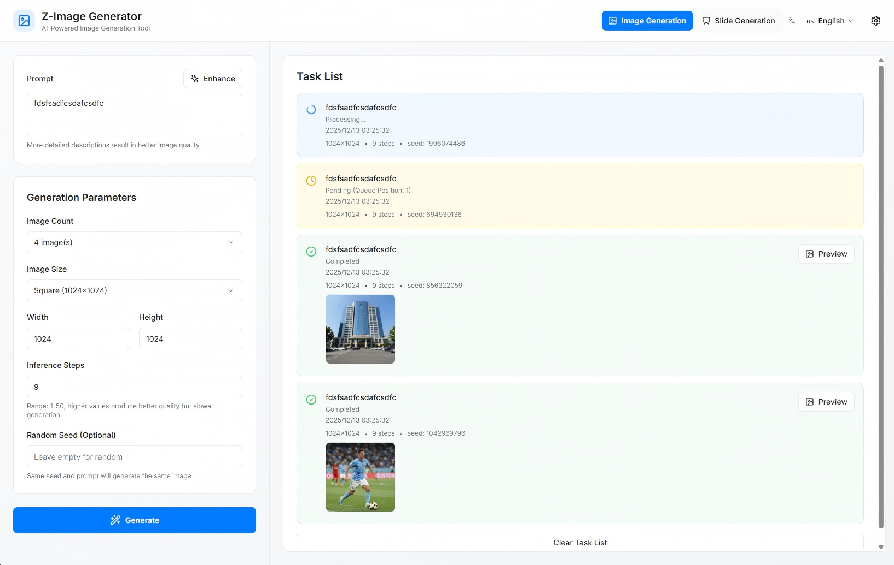

# Z-Image 图像生成系统

基于 Z-Image-Turbo 模型的 AI 图像生成系统，包含 Flask 后台服务和 Next.js 前端应用，提供完整的图像生成解决方案。



## 项目简介

Z-Image 是一个完整的 AI 图像生成系统，由以下两部分组成：

- **后台服务**：基于 Flask 的 Z-Image-Turbo 模型 API 服务，提供图像生成接口
- **前台应用**：基于 Next.js 14 的现代化 Web 应用，提供优雅的用户界面

系统采用前后端分离架构，支持任务队列管理、实时状态追踪、批量生成等功能，适用于生产环境部署。

## 功能特性

### 前台功能

- ✅ **苹果风格设计**：简洁优雅的 UI 设计，遵循苹果设计语言
- ✅ **移动端阻止**：仅支持桌面端访问，移动端显示友好提示
- ✅ **后台服务配置**：可配置后台服务 IP 和端口，支持连接测试
- ✅ **文本生成图片**：支持多张图片批量生成（1-4 张）
- ✅ **参数自定义**：支持图片尺寸、推理步数、随机种子等参数设置
- ✅ **提示词润色**：提供模板库和提示词增强功能
- ✅ **任务状态追踪**：实时轮询任务状态，显示队列位置和进度
- ✅ **图片预览下载**：支持图片预览和下载功能
- ✅ **错误处理**：完善的错误提示和异常处理
- ✅ **响应式设计**：适配不同桌面屏幕尺寸

### 后台功能

- ✅ **模型常驻内存**：模型启动时一次性加载，全局常驻 GPU 内存
- ✅ **任务队列机制**：线程安全的任务队列，支持并发请求
- ✅ **状态追踪**：完善的任务状态追踪和查询接口
- ✅ **错误处理**：完善的错误处理和日志记录
- ✅ **GPU 监控**：支持 GPU 使用情况监控
- ✅ **队列管理**：任务超时和队列管理机制
- ✅ **统一 API**：统一的 JSON API 响应格式

## 技术栈

### 前台技术栈

- **Next.js 14+** (App Router)
- **React 18+**
- **TypeScript**
- **Tailwind CSS** - 实用优先的 CSS 框架
- **shadcn/ui** - 基于 Radix UI 的组件库
- **Lucide React** - 图标库
- **axios** - HTTP 客户端
- **react-hot-toast** - 消息提示

### 后台技术栈

- **Flask** - Python Web 框架
- **PyTorch** - 深度学习框架
- **CUDA** - GPU 加速
- **Diffusers** - Hugging Face 扩散模型库
- **Gunicorn** - WSGI HTTP 服务器（生产环境）

## 环境要求

### 前台环境

- Node.js 18+
- npm / yarn / pnpm

### 后台环境

- Python 3.8+
- CUDA 11.8+ (GPU 环境)
- 至少 16GB GPU 显存
- 8GB+ 系统内存

## 快速开始

### 1. 克隆项目

```bash
git clone <repository-url>
cd Z-Image-BackendService
```

### 2. 安装后台依赖

```bash
pip install -r requirements.txt
```

### 3. 配置后台服务（可选）

创建 `.env` 文件或直接设置环境变量：

```bash
# GPU配置
GPU_DEVICE_ID=0
CUDA_AVAILABLE=true

# 模型配置
MODEL_NAME=Tongyi-MAI/Z-Image-Turbo
MODEL_TORCH_DTYPE=bfloat16

# 服务配置
HOST=0.0.0.0
PORT=5000
DEBUG=false

# 队列配置
MAX_QUEUE_SIZE=100
TASK_TIMEOUT=300

# 输出目录
OUTPUT_DIR=./outputs
```

### 4. 启动后台服务

#### 开发模式

```bash
python app.py
```

#### 生产模式（使用 Gunicorn）

```bash
gunicorn -w 1 -b 0.0.0.0:5000 --timeout 600 app:app
```

**注意**：由于模型需要独占 GPU，worker 数量应设置为 1。

后台服务启动后，默认运行在 `http://localhost:5000`

### 5. 安装前台依赖

```bash
cd frontend
npm install
# 或
yarn install
# 或
pnpm install
```

### 6. 配置前台后台服务地址

有两种方式配置后台服务地址：

**方式一：使用环境变量（推荐）**

在 `frontend` 目录下创建 `.env.local` 文件：

```bash
NEXT_PUBLIC_API_BASE_URL=http://localhost:5000
```

或者复制 `.env.example` 文件：

```bash
cp .env.example .env.local
```

然后修改 `.env.local` 中的地址。

**方式二：在应用内配置**

- 启动前台应用后，点击页面右上角的设置图标
- 输入后台服务地址，例如：`http://localhost:5000`
- 点击"测试连接"验证配置
- 点击"保存"保存配置

**配置优先级**：环境变量 > localStorage 配置 > 默认值 (`http://localhost:5000`)

### 7. 启动前台服务

```bash
cd frontend
npm run dev
# 或
yarn dev
# 或
pnpm dev
```

前台服务启动后，访问 `http://localhost:3000`

## 一键启动（推荐）

项目根目录提供了 `start.sh` 启动脚本，可以一键打包前台并启动后台和前台服务。

### 使用方法

1. **赋予执行权限**（首次使用需要）：

```bash
chmod +x start.sh
```

2. **执行启动脚本**：

```bash
./start.sh
```

### 脚本功能

- ✅ 自动检查环境依赖（Node.js、npm、Python）
- ✅ 自动打包前台应用（`npm run build`）
- ✅ 后台启动 Flask 服务（端口 5000）
- ✅ 前台启动 Next.js 服务（端口 3000）
- ✅ 详细的日志输出和错误处理

### 服务地址

- 后台服务：http://localhost:5000
- 前台服务：http://localhost:3000

### 停止服务

项目根目录提供了 `stop.sh` 停止脚本，可以一键停止后台和前台服务：

```bash
# 赋予执行权限（首次使用需要）
chmod +x stop.sh

# 执行停止脚本
./stop.sh
```

停止脚本功能：
- ✅ 自动查找并停止后台服务（端口 5000）
- ✅ 自动查找并停止前台服务（端口 3000）
- ✅ 支持多种进程查找方式（lsof、netstat、ps）
- ✅ 如果正常停止失败，会自动尝试强制停止
- ✅ 详细的日志输出

## 部署指南

### 后台服务部署

#### 使用 Gunicorn 部署

```bash
gunicorn -w 1 -b 0.0.0.0:5000 --timeout 600 app:app
```

#### 使用 systemd 管理（Linux）

创建服务文件 `/etc/systemd/system/z-image-backend.service`：

```ini
[Unit]
Description=Z-Image Backend Service
After=network.target

[Service]
Type=simple
User=your-user
WorkingDirectory=/path/to/Z-Image-BackendService
Environment="PATH=/path/to/venv/bin"
ExecStart=/path/to/venv/bin/gunicorn -w 1 -b 0.0.0.0:5000 --timeout 600 app:app
Restart=always

[Install]
WantedBy=multi-user.target
```

启动服务：

```bash
sudo systemctl start z-image-backend
sudo systemctl enable z-image-backend
```

#### 使用 Nginx 反向代理（可选）

```nginx
server {
    listen 80;
    server_name your-domain.com;

    location / {
        proxy_pass http://127.0.0.1:5000;
        proxy_set_header Host $host;
        proxy_set_header X-Real-IP $remote_addr;
        proxy_set_header X-Forwarded-For $proxy_add_x_forwarded_for;
        proxy_set_header X-Forwarded-Proto $scheme;
    }
}
```

### 前台服务部署

#### 构建生产版本

```bash
cd frontend
npm run build
```

#### 启动生产服务器

```bash
npm start
```

#### 使用 PM2 管理（推荐）

```bash
# 安装 PM2
npm install -g pm2

# 启动应用
cd frontend
pm2 start npm --name "z-image-frontend" -- start

# 查看状态
pm2 status

# 查看日志
pm2 logs z-image-frontend

# 停止应用
pm2 stop z-image-frontend

# 重启应用
pm2 restart z-image-frontend
```

#### 使用 Nginx 部署静态文件

```bash
# 构建静态文件
cd frontend
npm run build

# 导出静态文件
npm run export  # 如果配置了静态导出
```

Nginx 配置：

```nginx
server {
    listen 80;
    server_name your-domain.com;
    root /path/to/frontend/out;
    index index.html;

    location / {
        try_files $uri $uri/ /index.html;
    }

    # API 代理到后台服务
    location /api {
        proxy_pass http://127.0.0.1:5000;
        proxy_set_header Host $host;
        proxy_set_header X-Real-IP $remote_addr;
    }
}
```

### Docker 部署（可选）

#### 后台 Dockerfile

```dockerfile
FROM python:3.10-slim

WORKDIR /app

COPY requirements.txt .
RUN pip install --no-cache-dir -r requirements.txt

COPY . .

EXPOSE 5000

CMD ["gunicorn", "-w", "1", "-b", "0.0.0.0:5000", "--timeout", "600", "app:app"]
```

#### 前台 Dockerfile

```dockerfile
FROM node:18-alpine AS builder

WORKDIR /app

COPY package*.json ./
RUN npm install

COPY . .
RUN npm run build

FROM node:18-alpine

WORKDIR /app

COPY --from=builder /app/.next ./.next
COPY --from=builder /app/package*.json ./
COPY --from=builder /app/node_modules ./node_modules

EXPOSE 3000

CMD ["npm", "start"]
```

## API 接口概览

后台服务提供以下主要 API 接口：

### 1. 健康检查

```
GET /health
```

检查服务健康状态和模型加载状态。

### 2. 提交生成任务

```
POST /api/generate
```

提交图像生成任务，返回任务 ID。

**请求参数**：
- `prompt` (必填): 文本提示词
- `height` (可选): 图像高度，默认 1024
- `width` (可选): 图像宽度，默认 1024
- `num_inference_steps` (可选): 推理步数，默认 9
- `seed` (可选): 随机种子

### 3. 查询任务状态

```
GET /api/task/<task_id>
```

查询指定任务的状态和详细信息。

### 4. 获取生成结果

```
GET /api/result/<task_id>
```

获取生成的图像文件（任务完成时）。

### 5. 查询系统状态

```
GET /api/status
```

查询系统整体状态，包括队列信息、GPU 使用情况等。

详细 API 文档请参考 `README-BackendService.md`。

## 使用说明

### 生成图片

1. 在提示词输入框中输入您想要生成的图像描述
2. 设置生成参数：
   - **图片数量**：选择生成 1-4 张图片
   - **图片尺寸**：选择预设尺寸或自定义宽度和高度
   - **推理步数**：1-50，数值越大质量越好但速度越慢（默认 9）
   - **随机种子**：可选，相同种子和提示词会生成相同图像
3. 点击"开始生成"按钮
4. 任务提交后，在右侧任务列表中查看进度

### 提示词润色

1. 点击提示词输入框右侧的"润色"按钮
2. 选择以下方式之一：
   - **使用模板**：从模板库中选择预设提示词模板
   - **增强提示词**：自动为当前提示词添加质量词和风格词

### 预览和下载图片

1. 任务完成后，在任务列表中点击"预览"按钮
2. 在预览模态框中查看完整尺寸图片
3. 点击"下载"按钮保存图片到本地
4. 支持键盘快捷键：按 `ESC` 键关闭预览

## 常见问题

### 连接后台失败怎么办？

- 检查后台服务是否已启动
- 检查后台服务地址配置是否正确
- 检查网络连接是否正常
- 检查防火墙设置
- 使用"测试连接"功能验证配置

### 生成失败的常见原因

- **队列已满**：等待队列中的任务完成后再试
- **模型未加载**：检查后台服务日志，确认模型加载成功
- **GPU 内存不足**：降低图片尺寸或推理步数
- **参数错误**：检查参数是否在允许范围内

### 任务一直显示"等待中"？

- 检查后台服务是否正常运行
- 查看任务队列位置，如果位置很大可能需要等待较长时间
- 检查是否有其他任务正在处理

### 模型加载失败

- 检查 CUDA 是否可用：`python -c "import torch; print(torch.cuda.is_available())"`
- 检查 GPU 显存是否足够（至少 16GB）
- 检查模型路径是否正确

### GPU 内存不足

- 启用 CPU Offloading：`ENABLE_CPU_OFFLOAD=true`
- 减少并发任务数量
- 降低图像分辨率

## 项目结构

```
Z-Image-BackendService/
├── app.py                    # Flask 应用主文件
├── model_manager.py          # 模型加载和管理
├── task_queue.py             # 任务队列管理
├── config.py                 # 配置文件
├── requirements.txt          # Python 依赖清单
├── outputs/                  # 生成图像存储目录
├── README-BackendService.md  # 后台详细文档
├── start.sh                  # 一键启动脚本
├── stop.sh                   # 一键停止脚本
└── frontend/                 # 前台应用目录
    ├── app/                  # Next.js App Router
    ├── components/           # React 组件
    ├── hooks/                # 自定义 Hooks
    ├── lib/                  # 工具函数和配置
    ├── types/                # TypeScript 类型定义
    ├── public/               # 静态资源
    ├── package.json
    ├── tsconfig.json
    ├── tailwind.config.js
    ├── next.config.js
    └── README.md             # 前台详细文档
```

## 性能优化建议

1. **模型编译**：在配置中启用 `ENABLE_MODEL_COMPILE=true` 可以加速推理，但首次运行会较慢
2. **Flash Attention**：默认启用 Flash Attention-2，可提升性能
3. **队列管理**：根据 GPU 显存调整 `MAX_QUEUE_SIZE`，避免内存溢出
4. **批量处理**：虽然当前版本不支持批量，但可以通过并发提交多个任务来提高吞吐量

## 浏览器支持

- Chrome/Edge (最新版本)
- Firefox (最新版本)
- Safari (最新版本)

**注意**：本应用仅支持桌面端浏览器，移动端浏览器会显示阻止页面。

## 许可证

本项目基于 Z-Image-Turbo 模型，请遵循相应的许可证要求。

## 联系方式

如有问题或建议，请提交 Issue 或 Pull Request。

